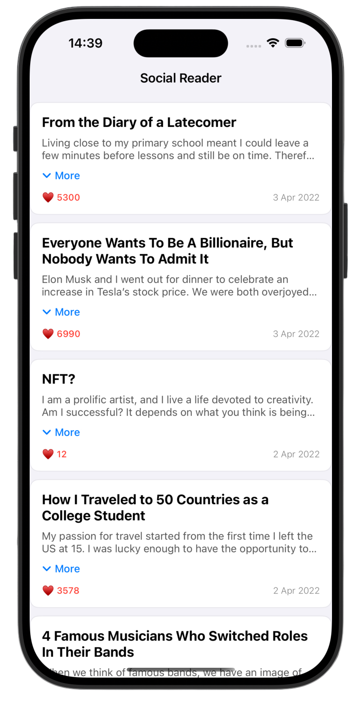
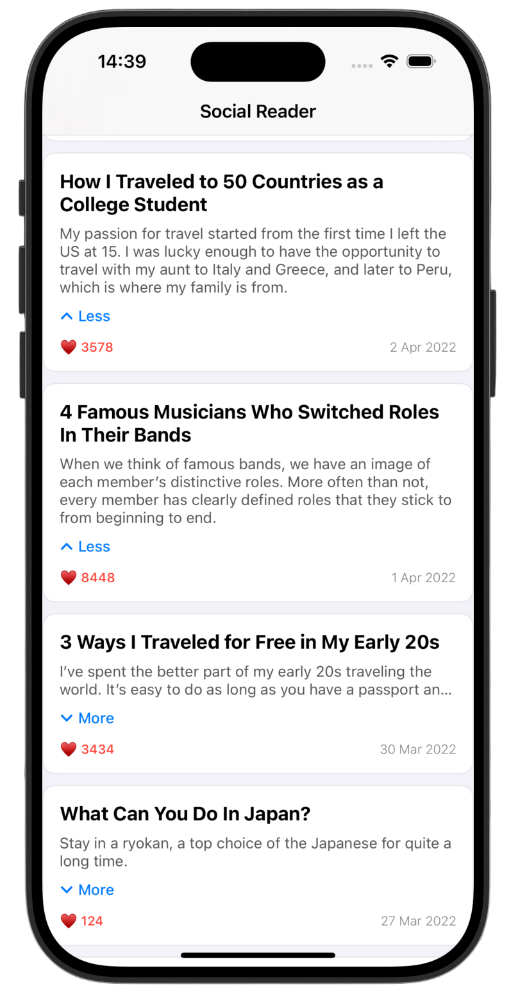
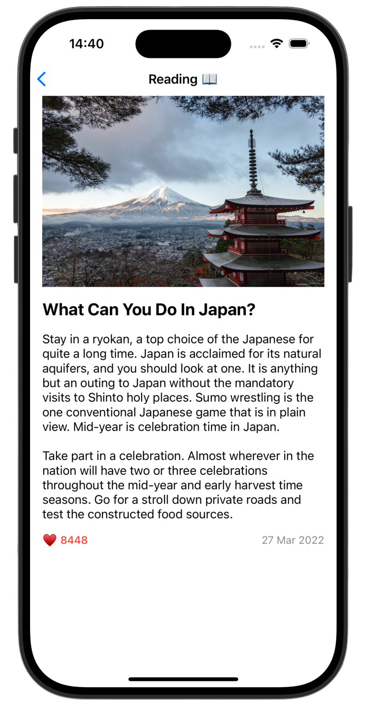

# Social Reader 📖

>SocialReader is a native iOS application that displays a dynamic feed of posts fetched from a REST API. It features expandable content, detailed reading views, and smooth animations powered by modern UIKit components..

---

## Key Features ✨ 

- ↕️ Dynamic Feed - Expand and collapse post previews with smooth animations
- 🌐 Real-time Data - Asynchronous fetching of posts from a remote REST API
- 💾 Smart Caching - Custom image loading system with `NSCache` for optimization
- 🎨 Modern UI - Built programmatically using Compositional Layout

---

## Screenshots

<div align="center">
  
  
  
</div>

---

## 🛠️ Technical Stack

<p align="center">
  <strong>Language:</strong> Swift<br>
  <strong>UI Framework:</strong> UIKit (Programmatic)<br>
  <strong>Architecture:</strong> MVVM<br>
  <strong>Concurrency:</strong> Async/Await + MainActor<br>
  <strong>Data Source:</strong> UICollectionViewDiffableDataSource
</p>

---

## 🏗️ Structure & Decisions

**Architecture (MVVM)**
The app is divided into three distinct layers to ensure testability and separation of concerns:
- **Model:** `Post` struct with `Decodable` and safe `CodingKeys`.
- **View:** `ViewController` and `PostCell` handle UI rendering only.
- **ViewModel:** `PostListViewModel` manages data fetching, sorting logic, and state changes.

**Modern Collection View**
Instead of the legacy `UITableView`, I utilized **Compositional Layout** combined with **Diffable Data Source**. This ensures smooth animations when expanding/collapsing posts and handles dynamic content height efficiently.

**Performance & Caching**
To optimize network usage, I implemented a custom `UIImageView` extension. It uses `NSCache` to store downloaded images in memory, preventing redundant network requests during scrolling and eliminating UI flickering.

---

## 📦 Installation

1. Clone the repository:
```bash
git clone https://github.com/gurman-man/Natife-Test-Task.git
```
2. Open `SocialReader.xcodeproj` in Xcode
3. Run on the simulator or your device

